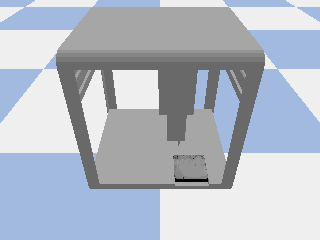

# Task 9 — Robotics Environment Interaction (OT-2 Simulation)

This task demonstrates interaction with a robotics simulation environment using the Opentrons OT-2 simulator. The objective is to explore and understand fundamental robotics concepts by commanding the robot, observing its state, and determining the work envelope (operational boundaries) of the pipette tip.

  

## Work envelope (pipette tip coordinates)

- **Z top:** `0.2896`
- **Z bottom:** `0.1694`
- **X +limit:** `0.2531`
- **X -limit:** `-0.1871`
- **Y +limit:** `0.2195`
- **Y -limit:** `-0.1706`

## Workspace Corners

| Corner             | X       | Y       | Z      |
| ------------------ | ------- | ------- | ------ |
| Front-Left-Bottom  |  0.2531 | -0.1706 | 0.1694 |
| Front-Right-Bottom |  0.2531 |  0.2195 | 0.1694 |
| Back-Left-Bottom   | -0.1871 | -0.1706 | 0.1694 |
| Back-Right-Bottom  | -0.1871 |  0.2195 | 0.1694 |
| Front-Left-Top     |  0.2531 | -0.1706 | 0.2896 |
| Front-Right-Top    |  0.2531 |  0.2195 | 0.2896 |
| Back-Left-Top      | -0.1871 | -0.1706 | 0.2896 |
| Back-Right-Top     | -0.1871 |  0.2195 | 0.2896 |

## Key Findings on Robot Behavior & Limitations
### Axis Semantics
- x / -x: moving further from or closer to the robot base
- y / -y: moving right / left
- z / -z: moving up / down

An unexpected upward jump in Z was observed immediately after starting the simulation. The exact cause is starting position which is below the lower Z limit

## Velocity Behavior
- X and Y velocities are applied as the negative of the action value
- Z velocity is applied directly, with no inversion

This asymmetry must be accounted for when designing control logic, otherwise axis movement may appear reversed.

### Z-Axis Initialization Behavior
At the start of the simulation, the initial Z position is below the measured lower Z limit. As soon as the simulation begins and commands are issued in Z-axis, the pipette moves upward into the valid Z work envelope, which appears as an immediate “jump” in Z.

This behavior is consistent with:
- The simulator initializing the robot in a non-operational or safety position
- Automatic correction to bring the pipette into the allowed workspace range

This is expected simulator behavior and not an error, but it must be accounted for when logging initial observations or detecting limits.

### Asymmetric Workspace Across X and Y Axes
The robot can move further in one direction than the other on both the X and Y axes. The OT-2 is not physically centered in its coordinate system.
- There is more reachable space in the positive X and Y directions
- Less space in the negative directions

    ***X⁺ ≠ |X⁻|, Y⁺ ≠ |Y⁻|***

## Stability at Workspace Boundaries
- Position coordinates become unstable or noisy when the pipette reaches the edge of the work envelope.
- A tolerance / threshold must be applied when detecting boundary conditions to prevent infinite loops during workspace exploration.
- 
**Why it happens:**
The simulator enforces:
- Mechanical constraints
- Collision prevention
- Safety limits

Instead of throwing an error, the simulator silently clips motion at the boundary. In case if control loop waits for: `position == target` and the target is outside the workspace, the condition is never satisfied, causing:
- Infinite loops
- Hanging programs

The tolerance / threshold must be used when checking whether a limit has been reached to prevent infinite loops.

## Environment setup

### Dependencies
- Python 3.x
- `pybullet`
- `numpy`
- `imageio` (used to write the GIF via `imageio.mimwrite`)